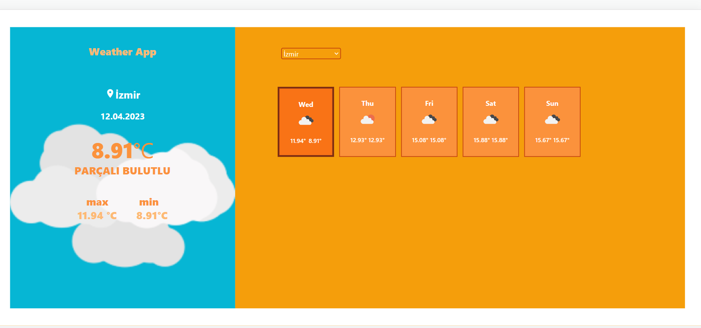

# Patika-Odev-3
FMSS Bilişim Front-end Practicum Ödev-3

OpenWeather API'yle ücretsiz olarak çekilen datalardan 1 günlük hava durumu birden fazla kayıt içerdiğinden(farklı saat dilimlerinde birden fazla veri bulunduğu için) saat 15:00:00 baz alınmıştır.Css olarak Tailwind kullanılmıştır

Ödev Tasarım:

Not:saat 15:00:00'da min ve max sıcaklık değerleri birebir aynı olduğu için test amaçlı 06:00:00'da alınan 
datayla  ödevin ekran görüntüsü alınmıştır .

